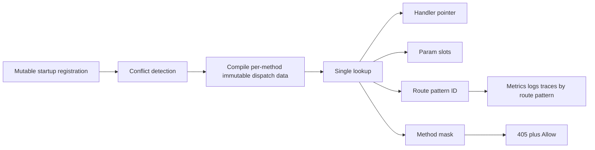
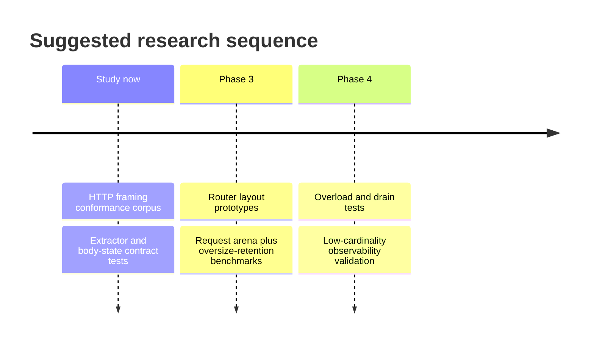

# Uruquim Phase Three and Phase Four Research Report

> **Status: NON-NORMATIVE RESEARCH.** Raw external research input. Claims and generated citation markers must be verified against primary sources before affecting specifications.

## Executive summary

The outer instruction described the topic as unspecified, but the uploaded brief actually specifies a concrete topic: research patterns and industry cases that can strengthen **Uruquim’s Phase 3 and Phase 4 work** on immutable routing, request-lifetime memory management, typed procedural extractors, defensive HTTP parsing, and production hardening. This report therefore follows the uploaded brief as the binding scope, does **not** claim access to the Uruquim codebase, and keeps the current public constraints in place: procedural API, synchronous handlers, no transport types in the public API, no request-scoped dynamic map, and no expansion of Phase 1 except where a decision would become unsafe or hard to reverse. fileciteturn0file0

Methodologically, this report follows the source order requested in the brief: RFCs and official specifications first, then official documentation, official source trees and maintainers’ technical material, and only then broader implementation examples. The most useful primary sources for this topic turned out to be RFC 9110 and RFC 9112, OpenTelemetry’s HTTP semantic conventions, official materials for `llhttp`, `httprouter`, `matchit`, `axum`, `chi`, `NGINX`, `Envoy`, `Pingora`, and H2O. fileciteturn0file0 citeturn12search8turn10view4turn11view0turn5view0turn6view3turn15view1turn1search0turn8search2turn18view0turn19view0

The central conclusion is straightforward. Uruquim should **not** chase a generic “framework feature race.” Instead, it should harden a small number of internal contracts: a frozen per-method routing core, a request-memory model with explicit oversize escape hatches, a strict parser/conformance matrix across transports, a single-consumer body discipline for extractors, and a production control plane centered on overload, drain, and low-cardinality telemetry. Where the evidence is strong, the design should move into ADR-worthy decisions. Where the evidence is incomplete—especially around the **best Odin-friendly router layout** and the **best allocator + retention policy mix**—the correct next step is a disposable benchmark, not a permanent API choice. citeturn5view0turn6view1turn13view2turn10view4turn15view1turn14view5turn11view0

## Recommendation matrix

The table below orders the recommendations by likely impact on Uruquim’s stated goals of performance, productivity, and AI legibility. “Planning cost” is an implementation-planning estimate, not a sourced fact.

| Recommendation | Classification | Why now | Planning cost | Main stakeholders |
|---|---|---:|---:|---|
| Freeze startup routing into immutable per-method dispatch data | PHASE_3 | It unlocks zero-allocation lookup, deterministic precedence, 404/405 correctness, and stable route-pattern observability with no public API change. citeturn5view0turn6view3turn12search8turn11view0 | Medium | Core maintainers, adapter authors, app developers |
| Adopt request arenas with oversize escape hatches and retention caps | PHASE_3 | It is the main lever for fewer hot-path allocations without accepting permanent RSS growth after large requests. citeturn13view1turn13view2turn13view3turn13view6turn14view7 | Medium | Core maintainers, deployers |
| Treat strict HTTP parsing as a conformance contract, not an adapter detail | STUDY_NOW | It reduces parser-difference bugs, closes request-smuggling classes, and is prerequisite work before multiple transports are trusted. citeturn10view4turn10view5turn16view1turn16view2 | Low to medium | Core maintainers, transport authors, security reviewers |
| Formalize extractor classes and a single-consumer body state machine | STUDY_NOW | It protects the existing procedural API from variant creep while making the correct path obvious to humans and LLMs. citeturn15view0turn15view1turn15view2turn15view5turn5view0 | Low | Core maintainers, app developers, AI agents |
| Add transport-neutral overload, drain, and low-cardinality observability budgets | PHASE_4 | It gives Uruquim realistic production guarantees without freezing a thread or event-loop model. citeturn17view0turn17view2turn14view5turn14view6turn11view2 | Medium | Deployers, SREs, adapter authors |

## Recommendations

### Freeze routing into immutable per-method dispatch data

- **Classification:** PHASE_3
- **Concrete problem:** Uruquim’s Phase 3 goals require zero-allocation lookup, deterministic precedence, startup conflict detection, `404` versus `405` separation, `Allow` generation, and route-pattern preservation for instrumentation, all while keeping the public API procedural and transport-neutral. Those goals are explicit in the project brief. fileciteturn0file0
- **Industry evidence:** `httprouter` uses a separate routing tree per HTTP method, emphasizes explicit one-route-or-no-route matching, reports built-in `405 Method Not Allowed` support, and states that matching can be allocation-free on the common path. `matchit` uses a radix trie with common-prefix compression, prioritizes likely branches, and makes static segments outrank dynamic ones while rejecting ambiguous overlaps. RFC 9110 requires an `Allow` header on `405`, and OpenTelemetry requires a low-cardinality route template rather than the raw URI path. citeturn5view0turn6view1turn6view3turn12search8turn11view0turn11view1
- **Transferable idea for Uruquim:** Keep registration mutable only at startup, then compile it into a **private immutable dispatch structure per method**. A successful lookup should return, in one pass, a handler pointer, a compact parameter descriptor/result buffer, a route-pattern identifier, and enough method metadata to produce `405` plus `Allow` without expensive secondary path logic. The key research question is **not** whether radix is fashionable; it is whether Odin performs best with a pointer tree, an index-based node arena, a Structure-of-Arrays layout, or a hybrid. That specific choice remains **UNVALIDATED** until measured under Odin with real route sets. citeturn5view0turn6view1turn6view3turn12search8turn11view0
- **What should not be copied:** Do not copy `chi`’s context-based parameter propagation, because its own benchmarks attribute allocations to cloning the request through `WithContext`. Do not copy route grammars that broaden the MVP beyond static segments, simple named parameters, and terminal wildcards. Do not let registration order become precedence. citeturn6view5 fileciteturn0file0
- **Disposable prototype or benchmark:** Build three internal router prototypes behind the same private interface: pointer-radix, index-array radix, and hybrid SoA. Feed them one identical corpus of static routes, `:param` routes, terminal wildcards, and known conflict cases. Measure lookup latency, allocations, branch misses, startup compilation cost, and memory footprint on the same hardware and Odin toolchain. The startup compiler should also emit a compact route-pattern table for observability tests. This is the right place to decide whether arrays and indices outperform linked nodes in Odin; until that run exists, the claim is **UNVALIDATED**. citeturn5view0turn6view1turn11view0
- **Metrics and acceptance criteria:** Zero allocations on static-path dispatch; zero hidden map allocations for path parameters on the common path; deterministic startup rejection of duplicates and ambiguous conflicts; correct `404` versus `405` behavior with `Allow`; preservation of a stable route pattern for metrics and traces; and no public API change. RFC-level `405` behavior should be part of the contract suite, not an incidental behavior. citeturn12search8turn12search1turn11view0
- **Possible impact on the public API:** Ideally none. At most, better conflict diagnostics during startup and better instrumentation output. That matches the brief’s request to change internals in Phase 3 without changing observable public behavior. fileciteturn0file0
- **Risk of turning into “Gin”:** Low, if the work stays private and does not leak alternative helper families or overlapping route registration semantics into the public API. High only if routing work becomes an excuse to add convenience aliases and route-metadata APIs that duplicate existing paths. fileciteturn0file0
- **Reversibility:** High, as long as the compiled representation is private and the route-pattern format used for observability is documented but not overexposed.
- **Primary sources:** RFC 9110 on `405` and `Allow`; OpenTelemetry HTTP semantic conventions; official `httprouter` README; official `matchit` README. citeturn12search8turn12search1turn11view0turn5view0turn6view3

### Use request arenas with oversize escape hatches and retention caps

- **Classification:** PHASE_3
- **Concrete problem:** Uruquim wants explicit lifetimes, request-scoped views over transport buffers, no hidden hot-path allocations, and future study of request arenas, reusable buffers, and retention control. The hard part is not merely “using an arena.” It is preventing one exceptionally large request from permanently inflating steady-state memory. fileciteturn0file0
- **Industry evidence:** NGINX ties memory pools to object lifetimes, distinguishes request pools from connection pools, forwards oversized allocations to the system allocator, and supports pool cleanup handlers for non-memory resources. NGINX also documents that large request bodies can spill beyond an in-memory body buffer into temporary files, caps request size with `client_max_body_size`, and closes keep-alive connections periodically in part to free per-connection memory allocations. Envoy adds another useful production pattern: a `shrink_heap` overload action that explicitly returns free memory to the OS under pressure. citeturn13view1turn13view2turn13view3turn13view5turn13view6turn14view1turn14view7
- **Transferable idea for Uruquim:** Make the request arena the default home for many **small request-lifetime objects** only. Large or atypical allocations should bypass the arena and be independently reclaimable. Reusable connection buffers should have a configurable retention cap so that “one huge request” does not define the new normal. Cleanup of temp files, deferred body-storage artifacts, or transport-owned objects must not rely on arena destruction alone; Uruquim should support explicit request cleanup hooks internally, just as NGINX pools do. The brief’s rule that request-derived views are valid only during the request fits this model very well, because persistent ownership becomes an explicit copy decision rather than an accidental leak. citeturn13view1turn13view2turn13view3turn13view4turn13view6turn14view7 fileciteturn0file0
- **What should not be copied:** Do not copy broad “request context storage” patterns or opaque per-request maps. Do not keep giant buffers forever just because they were expensive to allocate once. Do not assume that all cleanup is memory cleanup; temp files, deferred body readers, and other retained resources need explicit handlers. citeturn13view3turn13view6 fileciteturn0file0
- **Disposable prototype or benchmark:** Test three memory modes under the same load: baseline allocator only; request arena only; request arena plus oversize bypass plus post-spike downsize/retention cap. Use a mixed load of many small JSON requests with occasional 8 MiB, 32 MiB, and 64 MiB bodies. Record allocations per request, peak RSS, RSS five minutes after the large-body spike, p99 latency, and how often buffers are reused versus reallocated.
- **Metrics and acceptance criteria:** The steady-state RSS after a large-request spike should return to within a configured cap above the pre-spike baseline; hot-path requests should avoid hidden heap churn; request-lifetime objects should be freed in bulk; and connection-lifetime state should remain separate from request-lifetime state. If Uruquim later supports uploads or multipart in Phase 4, the same model should still hold. citeturn13view1turn13view5turn13view6turn14view1
- **Possible impact on the public API:** Likely none in Phase 3 beyond clearer documentation about lifetimes and copying. A future public body-limit setting is plausible, but it should remain narrow and unsurprising. fileciteturn0file0
- **Risk of turning into “Gin”:** Low. This is internal systems work unless it spills into a large family of “smart” helpers.
- **Reversibility:** Medium to high. The allocator policy is reversible if it stays private, but any public body-storage semantics become harder to change later.
- **Primary sources:** NGINX development guide and core HTTP directives; Envoy overload manager. citeturn13view1turn13view2turn13view3turn13view5turn13view6turn14view1turn14view7

### Treat strict HTTP parsing as a conformance contract, not an adapter detail

- **Classification:** STUDY_NOW
- **Concrete problem:** Uruquim explicitly wants multiple transports over time, yet parser differences across transports are exactly where framing ambiguity, cache poisoning, and request smuggling enter. If one adapter accepts cases that another rejects, the framework becomes observably inconsistent and potentially unsafe. fileciteturn0file0
- **Industry evidence:** RFC 9112 is unambiguous on several critical points: when both `Transfer-Encoding` and `Content-Length` are present, the message can signal request smuggling and the server must close the connection after responding; when a request has `Transfer-Encoding` whose final coding is not chunked, the server must send `400` and close; invalid framing is an unrecoverable error; if fewer octets arrive than `Content-Length` promised, the message is incomplete and the connection must close. RFC 9112 also says that a server on a persistent connection must either read the entire request body or close after responding, otherwise remaining octets can be misread as the next request. `llhttp` mirrors this strict stance: its leniency switches are disabled by default and explicitly warn about request-smuggling or poisoning exposure. citeturn10view4turn10view5turn10view1turn10view2turn10view3turn16view0turn16view2turn16view3turn16view4
- **Transferable idea for Uruquim:** Write a **transport-conformance corpus** as raw-bytes tests with expected outcomes: accept/reject, public status, whether the connection must close, and what internal error category should be emitted. Then run that exact corpus against every adapter that Uruquim ever supports. This makes “strictness” a framework contract rather than a parser accident. The core should define semantic expectations; the transport should expose just enough hooks to execute them. citeturn10view4turn10view5turn16view1turn16view2
- **What should not be copied:** Do not copy compatibility leniency flags into the default path. Do not normalize malformed framing into “best effort.” Do not expose parser-specific transport errors in the public API. Those choices reduce interoperability in the short term but increase ambiguity and attack surface. citeturn16view0turn16view1turn16view2turn16view4
- **Disposable prototype or benchmark:** Build a corpus around at least these cases: `CL+TE`, duplicate `Content-Length` with same and different values, malformed chunk sizes, LF-only line endings, truncated request body, extra bytes after `Connection: close`, `HTTP/1.0` plus `Transfer-Encoding`, invalid header whitespace, `HEAD` / `204` / `304` body expectations, and route-level `405` plus `Allow`. The prototype output should be a golden machine-readable manifest that all transports must pass. citeturn10view4turn10view5turn10view3turn12search8
- **Metrics and acceptance criteria:** A transport is acceptable only if it matches the golden matrix on all critical framing cases; critical errors close exactly when RFC 9112 requires closure; `405` always carries `Allow`; and malformed cases do not bypass the “write response once / observe internal error once” discipline described in the brief. citeturn12search8turn12search1turn10view4turn10view3 fileciteturn0file0
- **Possible impact on the public API:** None, except more predictable behavior. This is exactly the kind of research that should happen before transport-backend plurality grows.
- **Risk of turning into “Gin”:** None. This is contract work, not convenience work.
- **Reversibility:** High. A corpus can grow incrementally and remain private until stable.
- **Primary sources:** RFC 9112 message framing rules; RFC 9110 `405` / `Allow`; official `llhttp` documentation. citeturn10view4turn10view5turn10view1turn10view2turn10view3turn12search8turn12search1turn16view0turn16view2turn16view4

### Formalize extractor classes and a single-consumer body state machine

- **Classification:** STUDY_NOW
- **Concrete problem:** Uruquim already chose a procedural extractor style and deliberate early-return flow, but the next design risk is semantic drift: more helpers, more variants, and hidden body-consumption rules that make the API less predictable for both humans and LLMs. fileciteturn0file0
- **Industry evidence:** `axum` draws a clear line between body-free extraction (`FromRequestParts`) and body-consuming extraction (`FromRequest`). It enforces that only one extractor may consume the body and that it must be last; it also warns that middleware built from body-consuming extractors leaves the body empty for later handlers. Its JSON extractor rejects missing JSON content type, syntactically invalid JSON, deserialization failures, and request-body buffering failures; and it ships a default body limit on `Bytes`-based extractors as a security measure. In contrast, `httprouter` keeps route parameters as a slice rather than a dynamic map, while `chi` documents that context propagation itself accounts for request-cloning allocations. citeturn15view0turn15view1turn15view2turn15view4turn15view5turn5view0turn6view5
- **Transferable idea for Uruquim:** Keep the public API procedural, but formalize an internal taxonomy with four extractor classes: **view-only** (borrowed request data), **parse-from-view** (e.g., `path_int`, `query_int`), **body-consuming** (e.g., JSON/body decoders), and **persistent-copy** (explicit copy into a caller-chosen allocator). Then add a private body-state machine to `Context` so double-body-consume is impossible or at least deterministically rejected. This matches the brief’s design goals very well: explicit lifetimes, explicit copy rules, predictable control flow, and no hidden reflection or code generation. citeturn15view0turn15view1turn15view2turn15view5 fileciteturn0file0
- **What should not be copied:** Do not copy `axum`’s trait-heavy handler argument model, derive-macro culture, or rejection-type sprawl. Do not copy `chi`’s request-context transport for values. Do not add multiple public ways to parse the same input. The brief’s anti-Gin guardrails are correct here. citeturn15view0turn15view1turn6view5 fileciteturn0file0
- **Disposable prototype or benchmark:** Write contract tests and tiny compilable examples for missing parameter, malformed parameter, missing JSON content type, malformed JSON, oversized body, double body read, and gate-only middleware interacting with body-consuming extractors. Also add one test mode that poisons or invalidates request views after handler completion to catch accidental escape in debug builds. The debug-poison mechanism itself is **UNVALIDATED** and should be tested, not assumed.
- **Metrics and acceptance criteria:** One canonical extractor path for each common task; no hidden allocations on view-only path/query/header access; exactly one body-consuming operation permitted; malformed presence versus absence semantics preserved for `<type>_or` query helpers; and examples understandable without knowing transport internals. fileciteturn0file0 citeturn15view1turn15view4turn15view5
- **Possible impact on the public API:** Minimal if this remains mostly documentation, tests, and internal state tracking. Public impact becomes risky only if many new helper variants are introduced.
- **Risk of turning into “Gin”:** Medium **if** extractor taxonomy leaks into a large family of overlapping public APIs. Low if the taxonomy remains mostly internal and there is still one canonical form per task.
- **Reversibility:** Medium. Once public semantics around body reuse exist, they become sticky.
- **Primary sources:** Official `axum` extractor docs; official `httprouter` README; official `chi` README benchmarks. citeturn15view0turn15view1turn15view2turn15view4turn15view5turn5view0turn6view5

### Add transport-neutral overload, drain, and low-cardinality observability budgets

- **Classification:** PHASE_4
- **Concrete problem:** Phase 4 asks for graceful shutdown, timeouts, metrics, tracing, structured logging, and load tests, but the brief explicitly forbids freezing a threading model or exposing transport assumptions. Production controls therefore have to be expressed as framework contracts, not event-loop-specific tricks. fileciteturn0file0
- **Industry evidence:** NGINX’s `client_header_timeout`, `client_body_timeout`, and `send_timeout` are all defined as time between successive I/O operations, not whole-request deadlines; `client_max_body_size` limits request size; `keepalive_requests`, `keepalive_time`, and `keepalive_timeout` cap per-connection lifetime and memory retention. Envoy’s overload manager can stop accepting requests, disable keepalive/drain connections, stop accepting or reject incoming connections, shrink heap, and reduce timeouts as resource pressure rises. Envoy’s drain behavior distinguishes immediate stop from graceful drain, and its HTTP connection manager uses `Connection: close` for HTTP/1 and `GOAWAY` for HTTP/2 when draining. OpenTelemetry requires low-cardinality `http.route`, warns against substituting raw URI path, and requires predictable low-cardinality `error.type`. Pingora’s official materials are also notable because they explicitly advertise graceful reload and observability-tool integration in a high-performance Rust networking stack. citeturn17view0turn17view1turn14view1turn17view2turn14view5turn14view6turn14view7turn11view0turn11view2turn18view0
- **Transferable idea for Uruquim:** Express production controls as a small, transport-neutral budget layer: read progress timeout, write progress timeout, body limit, idle connection budget, graceful drain state, and admission/shedding decisions under overload. Then let each transport interpret those decisions in its own mechanics. Metrics, traces, and structured logs should key on route pattern, method, status, and low-cardinality framework error labels, never raw user paths or body-derived IDs. Hooks for logging and observability should be non-blocking or explicitly droppable under pressure so observability cannot dominate the hot path. citeturn17view0turn17view2turn14view5turn14view6turn11view0turn11view2turn18view0
- **What should not be copied:** Do not copy Envoy’s operational surface wholesale. Do not expose admin-endpoint semantics as the core abstraction. Do not use raw paths as span names or metric labels. Do not add many overlapping middleware-level knobs when a small set of framework budgets will do. citeturn17view2turn11view0turn11view3
- **Disposable prototype or benchmark:** Run three focused tests: a Slowloris-style header/body dribble client; a graceful-drain exercise with in-flight requests and new requests arriving during shutdown; and an overload run where idle timeouts and admission rules scale under memory pressure. Add a telemetry-parsing check that rejects labels or attributes whose cardinality explodes because the raw path leaked through.
- **Metrics and acceptance criteria:** Slow clients must trip deterministic progress timeouts; graceful drain must preserve the promised minimum for in-flight requests; low-cardinality route templates must be present when available; `error.type` must stay predictable; and overload modes must shed or discourage work before memory retention becomes runaway. citeturn17view0turn17view2turn14view5turn11view0turn11view2
- **Possible impact on the public API:** A modest configuration surface for limits, timeouts, graceful shutdown, and observability hooks is plausible. It should remain narrow and explicit.
- **Risk of turning into “Gin”:** Medium if this becomes a pile of middleware and header helpers. Low if it stays a small budget-and-contract layer.
- **Reversibility:** Medium. Operational semantics are easy to implement privately, but once promised publicly they become compatibility obligations.
- **Primary sources:** NGINX HTTP core documentation; Envoy overload and draining docs; OpenTelemetry HTTP semantic conventions; Pingora official README. citeturn17view0turn17view1turn14view1turn17view2turn14view5turn14view6turn14view7turn11view0turn11view2turn18view0

## Comparative evidence and visual aids

The table below is a concise literature review of the most transferable implementation lessons. It is **not** a cross-project benchmark league table; that would violate the brief’s warning against comparing unrelated benchmark numbers as if they were equivalent. fileciteturn0file0

| Source | What it demonstrates | Transferable lesson for Uruquim | What not to copy |
|---|---|---|---|
| RFC 9110 | `405` requires `Allow`; HTTP semantics define resource-method correctness. citeturn12search8turn12search1 | `405` behavior should be a contract, not a convenience feature. | Ad hoc method handling without method metadata. |
| RFC 9112 | Strict framing and close semantics for `CL+TE`, invalid lengths, incomplete bodies, and persistent connections. citeturn10view4turn10view5turn10view1turn10view2turn10view3 | Adapter-neutral conformance corpus is mandatory. | Lenient framing by default. |
| `llhttp` | Leniency switches are dangerous and disabled by default. citeturn16view0turn16view2turn16view3turn16view4 | Keep parser strictness on by default; treat deviations as explicit risk. | “Compatibility mode” as the common path. |
| `httprouter` | Per-method trees, explicit matching, cheap params, built-in `405`, low-allocation dispatch. citeturn5view0 | Freeze route tables per method and return compact param slices. | Request-context-based params or registration-order precedence. |
| `matchit` | Radix trie, zero-copy lookup, static-over-dynamic priority, startup conflict errors. citeturn6view1turn6view3 | Conflict detection belongs at startup; immutable dispatch data belongs at runtime. | Broad grammar extensions that exceed Uruquim’s MVP. |
| `axum` | Clean split between body-free and body-consuming extraction; one body consumer only. citeturn15view0turn15view1turn15view5 | Internal extractor taxonomy and a body state machine are worth formalizing. | Trait-heavy public API or macro-driven ergonomics. |
| `chi` | Context propagation allocates due to request cloning. citeturn6view5 | Avoid God-context transport for per-request metadata. | Request locals/maps as the default extensibility story. |
| NGINX | Request pool versus connection pool, oversize allocation fallback, cleanup handlers, body/temp-file split, timeout and keepalive controls. citeturn13view1turn13view2turn13view3turn13view6turn17view0turn17view1 | Separate lifetimes, cap retention, spill oversized bodies deliberately. | Permanent retention of the biggest buffer ever seen. |
| Envoy | Overload actions, timeout scaling, drain semantics, heap shrink, HTTP `Connection: close` / `GOAWAY` on drain. citeturn14view5turn14view6turn14view7turn17view2 | Model overload and shutdown as budgets and lifecycle stages. | Copying Envoy’s full control-plane shape. |
| OpenTelemetry | `http.route` must be low-cardinality and cannot be replaced with raw path; `error.type` should be predictable and low-cardinality. citeturn11view0turn11view2turn11view3 | Preserve route patterns and reserve a small framework error taxonomy. | Raw path labels, user IDs, or free-form error strings. |

A good internal shape for the Phase 3 routing work is shown below. The important point is not the exact node representation; it is the **compile-once, dispatch-many** boundary. citeturn5view0turn6view1turn11view0

## Blind spots and rejected ideas

### Blind spots found

Several important edge cases are still underexplored in the brief and deserve explicit tests early. The first is **message-semantic edge cases** around `HEAD`, `204`, `304`, and persistent-connection body disposal: RFC 9112 says those responses have no message body, and also says a server on a persistent connection must read the full request body or close after responding. That makes “early error then keep connection alive” a real design obligation, not a cleanup detail. citeturn0search0turn10view3

The second blind spot is **`Expect: 100-continue` and early rejection behavior**. This matters because Uruquim wants body limits, explicit extractor failure behavior, and transport neutrality, yet early-body handling can easily drift between adapters. I did not find enough directly transferable official material in the current research set to recommend exact semantics here, so this remains **UNVALIDATED** and should enter the conformance corpus before multiple adapters are treated as equally safe. citeturn10view4turn17view0

The third blind spot is **escape detection for request-backed views**. The brief correctly states that request-derived views are valid only for the request lifetime, but that guarantee is easy to document and easy to violate accidentally. A debug-only poison/sentinel strategy may be worthwhile, but whether that is practical in Odin without harming debuggability is **UNVALIDATED**. fileciteturn0file0

### Rejected ideas and why

Several common framework patterns should be rejected now rather than “reconsidered later.” A public transport-bearing context, a request-scoped dynamic map, public `rawptr`, or generic `locals` store all cut directly against Uruquim’s stated lifetime and boundary rules, and similar context-based patterns in `chi` visibly carry allocation cost. fileciteturn0file0 citeturn6view5

Heavy reflection, code generation, or a public extractor metaprogramming story should also be rejected for the current phases. The brief prioritizes explicitness, AI legibility, and a small set of canonical forms, while the best official extractor evidence from Rust relies on trait systems and macro ecosystems that do not transfer cleanly to Odin. fileciteturn0file0 citeturn15view0turn15view1turn15view5

Finally, “zero allocation at all costs” is the wrong optimization target. NGINX’s design explicitly uses pools, large-allocation fallback, and body temp files; Envoy explicitly exposes heap-shrinking and timeout scaling under overload. The lesson is that **allocation avoidance is useful only when it coexists with bounded retention and protocol safety**. citeturn13view2turn13view6turn14view5turn14view7

## Research order and disposable experiments

A sensible research order is to harden contracts first, then choose data structures, then tune production behaviors. That sequence minimizes irreversible mistakes. fileciteturn0file0

### Recommended research order

Start with the **HTTP conformance corpus** and the **extractor/body-state contract tests**. Those two items are cheap, high-leverage, and protect every later transport or API decision. Next, run the router representation prototypes and the request-memory retention benchmarks on the same machine and route/body corpora. Only after those results exist should Uruquim lock in Phase 3 internals. Phase 4 production work should then build on those stable contracts rather than trying to define semantics during load testing. citeturn10view4turn15view1turn5view0turn13view1turn14view5

### Suggested disposable experiments

The highest-value disposable experiments are these:

- **Router shootout:** pointer-radix vs index-radix vs hybrid SoA, same route corpus, same Odin toolchain, same benchmark harness. Decide lookup/core memory only after this run. citeturn5view0turn6view1
- **Retention spike test:** lots of tiny JSON requests, then periodic very large bodies, then return to tiny traffic. Track whether RSS and retained buffer sizes decay back toward baseline. citeturn13view6turn14view7
- **Parser corpus runner:** raw malformed HTTP cases executed through every adapter with expected status and close semantics. citeturn10view4turn10view5turn16view1
- **Extractor misuse suite:** missing content type, malformed JSON, double body read, gate-only middleware, and request-view escape in debug mode. citeturn15view1turn15view2turn15view5
- **Slow-client and graceful-drain test:** stalled headers, stalled body, stalled response reader, and mixed in-flight traffic during drain. Validate timeout semantics and shutdown guarantees without assuming a specific concurrency backend. citeturn17view0turn17view2turn14view5

## Human decisions and conclusion

### Questions requiring human decision

The biggest human decision is **route overlap policy**. Should Uruquim allow `/users/new` and `/users/:id` together with static priority, as `matchit` does, or reject that shape entirely for simpler mental models? There is no universally correct answer; the evidence supports either a careful static-priority policy or a stricter “explicit only” policy, but the product goal of AI legibility may favor the stricter rule unless benchmarks and real use-cases argue otherwise. citeturn6view3turn5view0

The next human decision is **oversized-body strategy**. If Phase 4 later introduces uploads and multipart, should core Uruquim ever spill to temporary files, or should that remain transport-specific or package-specific? NGINX shows the operational value of temp-file spillover, but the brief’s anti-kitchen-sink stance means the team should decide whether disk-spill belongs in core or behind a narrower package boundary. citeturn13view6turn17view0 fileciteturn0file0

A third human decision is **minimum graceful-shutdown promise**. Envoy distinguishes immediate stop from graceful drain and even allows new connections during a configurable drain period. Uruquim should decide the minimum cross-transport contract it is willing to guarantee—probably “stop new application work, discourage or close reusable connections, and let in-flight requests finish up to a budget”—before it exposes public configuration. citeturn17view2turn14view5

### Conclusion on what deserves ADR and what should remain research

The ideas that now merit ADR treatment are these: the **startup-to-runtime routing compilation boundary**, the **publicly observable route conflict and `405` policy**, the **request-memory lifetime split with oversize fallback**, the **transport-conformance suite as a release gate**, and the **production contract for timeouts, draining, and low-cardinality route-based observability**. Each of those affects correctness or compatibility enough to justify an ADR once the small prototypes confirm the chosen internal shape. citeturn12search8turn11view0turn13view1turn10view4turn14view5

The ideas that should remain research-only for now are the **exact router memory layout**, the **exact arena implementation details**, any **debug-only escape-detection mechanism**, and any **future extractor expansion beyond the current procedural forms**. Those topics are important, but they are internal optimization choices until benchmarks and usability tests show a clear winner. In short: lock the contracts, benchmark the representations, and keep the public surface small. That is the path most consistent with Uruquim’s stated goals and with the strongest evidence from the surrounding HTTP systems ecosystem. fileciteturn0file0 citeturn5view0turn6view1turn13view2turn15view1turn11view0
