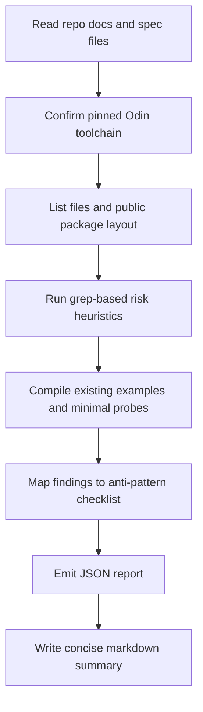

# Gin Criticism Research for Uruquim

> **Status: NON-NORMATIVE RESEARCH.** External claims and generated citation
> tokens in this report require source verification before reuse. The report's
> favorable references to returned-error handlers do not override Experiment
> 10 or ADR-011. The accepted Uruquim-specific translation lives in
> `planning/15-public-api-anti-accretion-guardrails.md`.

## Executive summary

There is no realistic way to build a web framework that literally *everyone* likes, but the criticism around Gin is consistent enough that it can be turned into a useful “do not repeat this” checklist for Uruquim. The strongest recurring complaints are not really about raw speed. They are about a framework-specific context type replacing the platform’s native HTTP model, a very large public API with many overlapping helpers, hidden control-flow side effects in binding and middleware, untyped request-local storage, scope creep in the core engine type, and defaults that can surprise users in production. Those complaints show up in Gin’s official API/docs, community threads, and prominent essays, while the main alternatives—`net/http`, chi, and Echo—tend to be praised for smaller surfaces, better composability, or centralized error handling. citeturn0search0turn1search0turn2search1turn3search0turn14search1turn13search2

For Uruquim, the practical takeaway is this: avoid “framework gravity.” The moment the framework becomes the place where request parsing, response rendering, middleware state, transport lifecycle, templating, content negotiation, and ad-hoc request storage all meet, you start recreating the same objections people raise about Gin. Uruquim’s current spec already avoids some of the highest-risk moves—canonical small API, no `user_data` on the public `Context`, explicit extractor patterns, future transport isolation, and an Echo-like error direction—but those constraints should now be enforced as anti-regression checks. citeturn14search1turn4search0turn4search1

The most important mindset shift is this: Gin’s critics are often reacting to *accumulated convenience*. Gin’s creator explicitly frames the project as trying to sit between Martini’s magic and `net/http`’s explicitness, with `gin.Context` carrying request/response helpers and other repetitive plumbing, and later described the project as absorbing years of other people’s use cases and taste. That is exactly the growth path that can make a framework popular and later controversial. fileciteturn0file5

## What the criticism of Gin actually clusters around

The first cluster is **non-idiomatic lock-in**. Gin’s handler signature is `func(c *gin.Context)`, not the standard library’s `func(w http.ResponseWriter, r *http.Request)`, and its core `Context` becomes the center of request handling, binding, rendering, middleware flow, and request-local values. By contrast, chi explicitly advertises itself as small, idiomatic, composable, and 100% `net/http` compatible, while Go 1.22+ added method-and-wildcard routing directly to `net/http`, reducing one of the historical reasons people reached for third-party routers in the first place. Once application code deeply depends on framework-specific context helpers, migration gets more expensive. citeturn2search1turn2search5turn3search0turn3search2turn3search3

The second cluster is **API surface explosion**. Gin’s engine exposes route registration, server start methods (`Run`, `RunTLS`, `RunUnix`, `RunListener`, `RunFd`, `RunQUIC`), HTML/template helpers, proxy configuration, and middleware setup from the same top-level type. Its context also exposes a very large set of helpers for binding, responding, cookies, headers, redirects, typed getters, streaming, and more. The official docs also distinguish between “must bind” and “should bind” families, plus multiple body-binding helpers like `ShouldBindBodyWithJSON`, which is convenient but increases the number of “almost the same” APIs users must remember. Prominent community criticism centers on exactly this sprawl. citeturn15search4turn7search4turn11search5turn8search1turn13search1

The third cluster is **hidden side effects and ambiguous control flow**. Gin’s official docs state that `Bind`, `BindJSON`, and similar “must bind” methods abort the request and write a `400` automatically. The docs also warn that if you later try to set a different status code, you can hit a “headers were already written” warning. That means a parsing helper is not only parsing—it is also committing response behavior. Echo takes a notably different route: handlers and middleware return `error`, and one centralized `HTTPErrorHandler` turns that into the response. Echo still has to respect response-commit semantics, but the error path is structurally more visible. This difference matters because “convenient” hidden side effects are a major source of debugging pain in web frameworks. citeturn7search0turn7search4turn14search0turn14search1

The fourth cluster is **untyped request-local state and lifetime hazards**. Gin’s source and docs expose request-local keys, and its middleware/logger plumbing still surfaces `Keys map[any]any` in current source. Gin’s docs also explicitly warn that you must call `c.Copy()` before using a context in a goroutine because Gin reuses `Context` objects from a `sync.Pool`; otherwise, the original context may be reassigned to a different request after the handler returns. This is an official admission that convenience around a mutable all-in-one context comes with lifetime sharp edges. citeturn10search0turn11search5

The fifth cluster is **scope creep and “kitchen sink” pressure**. The official package presents Gin as a high-performance framework with routing, middleware, validation, rendering, and a large middleware ecosystem, while the live repo currently shows a large public issue/PR surface. The sharpest essay against Gin argues that the library’s dependency tree and scope far exceed the core HTTP problem it is supposed to solve; even if one disagrees with the rhetoric, the underlying warning about API accretion is broadly shared in community discussions. Meanwhile, the creator’s own retrospective is very clear that Gin’s success came from making common work “one method call away,” which is precisely the mechanism by which focused tools often become broader than intended over time. citeturn0search0turn0search1turn8search1turn13search2fileciteturn0file5

The sixth cluster is **unsafe or surprising defaults**. Gin’s own docs warn that trusting all proxies by default is “NOT safe” unless you explicitly configure trusted proxies or disable the feature. Whether or not a team objects to the rest of Gin’s design, that is a concrete example of why framework defaults matter: production behavior should skew safe and unsurprising. citeturn1search0

Some developers still like Gin, especially for speed of onboarding and one-stop ergonomics; the criticism is recurring, not universal. But the pattern of criticism is stable enough to be turned into concrete design constraints for Uruquim. citeturn0search0turn13search2fileciteturn0file4

## Translation into Uruquim risks

The most direct translation is that Uruquim should treat **small public surface area** as a product feature, not just a nice-to-have. Gin’s critics are often reacting to there being too many nearly equivalent public ways to do request parsing or response writing. Uruquim’s canonical API—`web.app`, route registration, `web.path_int`, `web.query_int_or`, `web.body`, `web.ok`, `web.created`, `web.serve`—is already much closer to the “one obvious way” rule. That must remain true even if future phases add features. If a new feature cannot fit behind one canonical name and one documented pattern, it likely belongs in the advanced API or not in core at all. This also aligns with Uruquim’s stated goal of remaining usable by weaker coding models. citeturn2search1turn3search0turn4search0

The second translation is that **request context should not become a junk drawer**. Uruquim’s current spec already rejects `user_data`, `locals`, and `map[string]any` on the canonical `Context`, which is precisely the right reaction to Gin-like `Set`/`Get` patterns. Application-specific request values should continue to arrive through typed extraction procedures or future typed request state, not arbitrary dynamic storage. citeturn10search0turn11search5

The third translation is that **helpers must not hide response commits unless the contract makes that unavoidable and obvious**. Gin’s “must bind” vs “should bind” distinction is functional, but it multiplies APIs and smuggles control flow into helpers. Uruquim’s extractor contract is cleaner: fallible extractors either return `(value, ok)` or fill a destination and return `bool`; if they fail, they write the full error response and the handler returns immediately. That is still a side effect, but it is *canonical* and the control-flow shape is one line. The danger is letting additional variants creep in until the rules are no longer obvious. Echo’s centralized error model is useful here as a long-term reference for the broader error story. citeturn7search0turn7search4turn14search1

The fourth translation is that **transport and server lifecycle must stay behind the boundary**. Gin’s engine exposes transport/server entry points directly, including QUIC-specific methods, which makes the core type a place where routing, middleware, and server lifecycle all meet. Uruquim’s design is better if `web.serve(&app, port)` remains the canonical entry point and transport-specific details stay internal to the adapter layer—especially because the future Odin `core:net/http` package is not here yet, while `core:nbio` already implies callback/event-loop concerns that the public API should not leak. citeturn15search4turn4search0turn4search1

The fifth translation is that **lifetime rules must be aggressively explicit**. Gin had to document `c.Copy()` because pooled contexts make post-request use hazardous. Uruquim’s request-view model has a similar class of risk if handlers or background tasks retain slices/strings/headers beyond the request. Since Odin is explicit and allocator-aware, Uruquim should keep request-derived data as request-lifetime views by default and require explicit copy procedures for anything persistent. The official Odin JSON API already takes an allocator parameter for unmarshal, which is exactly the sort of primitive Uruquim can use to keep ownership rules clear instead of magical. citeturn11search5turn6search0

### Problematic Gin patterns and the equivalent Uruquim risk

A canonical Gin footgun is auto-binding with hidden response side effects:

```go
func createUser(c *gin.Context) {
    var in CreateUser
    if err := c.BindJSON(&in); err != nil {
        // BindJSON may already have aborted and written 400
        c.JSON(422, map[string]string{"error": "unprocessable"}) // warning-prone
        return
    }
    c.JSON(201, in)
}
```

The risky equivalent in Uruquim is not identical, but it rhymes:

```odin
create_user :: proc(ctx: ^web.Context) {
    input: Create_User
    if !web.body(ctx, &input) {
        // correct pattern is to return immediately
        // anything else risks double-write or contradictory intent
    }

    web.created(ctx, input)
}
```

This Odin snippet is valid *only as an anti-pattern example*. In canonical Uruquim code, the `if !web.body(...) { return }` rule must be immediate and non-negotiable. The analyzer should flag any body/path extractor failure branch that does not return right away. The design goal is to keep the side effect obvious, singular, and testable. citeturn7search0turn7search4

A second common Gin pattern is dynamic request-local storage:

```go
func auth(c *gin.Context) {
    user := lookupUser(c)
    c.Set("user", user)
    c.Next()
}

func profile(c *gin.Context) {
    user := c.MustGet("user").(*User)
    c.JSON(200, user)
}
```

The equivalent Uruquim risk is **hypothetical and should remain forbidden**:

```odin
// hypothetical bad design — should not exist in Uruquim
ctx.locals["user"] = user
user := ctx.locals["user"].(^User)
```

If anything like `locals`, `values`, `map[string]any`, `rawptr`-backed public request storage, or untyped `Get*` helpers appears in the canonical API, the project is drifting straight toward one of the most common Gin criticisms. citeturn10search0turn11search5

A third Gin hazard is using request context after the request lifetime without copying:

```go
r.GET("/async", func(c *gin.Context) {
    go func() {
        _ = c.Query("q") // unsafe without c.Copy()
    }()
})
```

The Uruquim equivalent risk would be retaining request views across task boundaries:

```odin
// hypothetical lifetime bug
spawn_background(proc() {
    _ = ctx.request.path
    _ = ctx.request.body
})
```

Because Uruquim’s request fields may be transport-owned views with request-scoped lifetime, any future background-task pattern must require explicit persisted copies. That rule is even more important in Odin than in Go because Uruquim is intentionally allocator- and ownership-aware. citeturn11search5turn6search0turn4search1

## Prioritized checklist and remediation table

The table below turns recurring Gin criticism into concrete Uruquim audit items.

| ID | Gin criticism | Concrete Uruquim risk | Detection heuristics | Remediation | Priority |
|---|---|---|---|---|---|
| URUQ-GIN-001 | Framework-specific context becomes the application’s main API | Business/domain code imports `web.Context` or depends on framework helpers | Flag non-HTTP packages importing `vendor:web`; flag services/repos taking `^web.Context` | Keep `^web.Context` at the HTTP adapter edge; pass typed DTOs into services | High |
| URUQ-GIN-002 | Too many ways to do the same thing | Exported synonyms for parse/respond/query proliferate | Count exported procedures by concept; flag >1 canonical pattern unless exact-equivalence convenience is documented | Enforce one public name per concept; keep only exact-equivalence helpers like `ok`/`created` | High |
| URUQ-GIN-003 | Binding helpers hide response side effects | Extractors write errors but handlers continue | Flag `web.body`, `web.path_*`, `web.query_*` failure branches that do not immediately `return` | Add tests and lint rule for canonical extractor control flow | High |
| URUQ-GIN-004 | Untyped request-local storage | Public `Context` gains `locals`, `values`, `map[string]any`, `map[typeid]any`, or public `rawptr` escape hatches | Grep public API/docs/examples for these names and types | Keep typed extraction procedures only; reserve typed request state for advanced API | High |
| URUQ-GIN-005 | “Kitchen sink” engine type | `App` mixes routing, transport, static files, templates, QUIC/TLS methods, proxy policy | Flag public `App`/`Engine` methods named `serve_tls`, `serve_quic`, `static*`, `template*`, `trusted_proxies`, transport-specific nouns | Keep canonical API small; move production knobs to `Advanced_Config` or adapters | High |
| URUQ-GIN-006 | Large public middleware surface with ambiguous semantics | `next`/post-`next` behavior becomes unclear; abort model leaks into user code | Search for middleware examples with code after `web.next(ctx)` and no formal semantics; search for multiple middleware execution models | Freeze one middleware model per phase; test it under transport conformance | High |
| URUQ-GIN-007 | Request lifetime hazards from pooled/ephemeral contexts | Request-derived slices/strings escape the request or are used in background tasks | Flag spawned tasks/threads/callbacks capturing `ctx` or `ctx.request.*`; flag storing request fields in app state | Provide explicit copy helpers; document request-view lifetime everywhere | High |
| URUQ-GIN-008 | Unsafe or surprising defaults | `web.app()` claims production defaults but misses recovery/body limit/timeouts or has permissive trust behavior | Search docs/spec for promised defaults vs implementation/tests; flag proxy-trust-like defaults | Keep defaults safe; if not implemented yet, mark as staged contract with tests per phase | High |
| URUQ-GIN-009 | Reflection/magic-heavy binding and validation | MVP adds generic bind/render/validation variants faster than Odin ergonomics justify | Flag public APIs using `any` in core binding/render paths; flag multiple serialization formats in MVP core | Keep MVP to JSON only; add other formats later and only if demand is proven | Medium |
| URUQ-GIN-010 | Binary/dependency bloat | Core framework pulls in multiple codecs or large optional features too early | Count external deps in core; flag >1 JSON package or optional protocols in core package graph | Keep core dependency-light; isolate optional features into adapters or subpackages | Medium |
| URUQ-GIN-011 | Conflation of parsing and transport | Public API leaks backend package names or transport details | Grep public signatures/docs/examples for `odin-http`, `core:net/http`, `core:nbio` | Maintain transport-neutral public API | Medium |
| URUQ-GIN-012 | Poor or divergent documentation | README, spec, quick-start, and AI context disagree on names or patterns | Diff for canonical names (`app` vs `create`, `serve` vs `run`, `path_int` vs `param_int`) | Freeze “first-contact vocabulary”; test docs via examples | High |
| URUQ-GIN-013 | Debugging depends on tribal knowledge | Hidden commit rules, middleware order, allocator/lifetime rules not codified in tests | Search for missing contract tests around double writes, body reuse, response commit | Add contract suite cases before feature growth | High |
| URUQ-GIN-014 | Popularity-driven accretion overwhelms focus | Every convenience request becomes a core API addition | Review new proposals for “can this be done in user code?” and “does it create a second canonical way?” | Use ADRs and change budgets for public API | Medium |

### Short remediation plans by risk

For lock-in, the best remediation is architectural: ban framework types from business-layer signatures and keep HTTP handling as an adapter layer. This is the single most important long-term maintainability defense. citeturn2search1turn2search5

For API sprawl, the remediation is governance rather than code: every new public helper must prove that it is not a synonym, not phase leakage, and not transport leakage. Gin’s history suggests that once convenience aliases accumulate, they rarely go away. citeturn15search4fileciteturn0file5

For hidden side effects, the remediation is contract tests: double-write, already-committed response, extractor-failure-must-return, and middleware-short-circuit tests should exist before feature growth. Echo’s central error model is useful as a reference point for how visible control flow can remain even in a convenience-oriented framework. citeturn7search0turn14search1

For lifetime hazards, the remediation is explicit ownership API design: request views are temporary by default; persistence requires named copy functions and explicit allocator choice. This is especially important given Odin’s allocator-centric JSON APIs and the future callback/event-loop-oriented transport direction. citeturn6search0turn4search0turn4search1

## Analyzer workflow and exact Plan Mode prompt



### Exact prompt for Codex or another LLM in Plan Mode

```text
You are running in PLAN MODE only.

Do not implement or refactor production code.
Do not rewrite the framework.
Do not change public APIs.
Do not create new architecture on your own.
Only inspect, compile, grep, compare against checklist items, and report findings.

Project: Uruquim
Language authority: Odin dev-2026-07a, pinned commit 819fdc7
The pinned toolchain is the practical authority for all compile checks.

Mission:
Audit the repo for design risks analogous to the most common community criticisms of Gin in Go.
Use the checklist below.
Do not perform the fixes.
Only report.

Primary goals:
1. Read the repo and its knowledge/spec/docs files first.
2. Confirm the Odin toolchain version with `odin version`.
3. Run static inspections (list files, grep patterns, public API scans).
4. Compile minimal examples using the pinned Odin toolchain when possible.
5. Produce:
   - a machine-readable JSON report
   - a concise markdown summary

Required JSON schema:
{
  "toolchain": {
    "odin_version": "...",
    "matches_expected_pin": true,
    "notes": "..."
  },
  "summary": {
    "repo_root": "...",
    "total_findings": 0,
    "high": 0,
    "medium": 0,
    "low": 0
  },
  "findings": [
    {
      "issue_id": "URUQ-GIN-001",
      "description": "text",
      "file_paths": ["a/b.odin", "docs/x.md"],
      "severity": "low|medium|high",
      "evidence_snippet": "short snippet",
      "recommendation": "short recommendation"
    }
  ]
}

Use exactly these fields for each finding:
- issue_id
- description
- file_paths
- severity
- evidence_snippet
- recommendation

Severity rules:
- high: public API risk, transport leakage, untyped context storage, hidden response side effects, lifecycle bugs, documentation drift in canonical API
- medium: optional feature creep, excessive helper duplication, weak defaults not yet wired to production paths
- low: naming inconsistency in internal code, speculative future risk without evidence in public API

False-positive guidance:
- Do NOT flag `web.ok` and `web.created` as duplicate APIs if documentation shows they are exact equivalences of `web.json` with fixed status.
- Do NOT flag the split between “value-producing extractor” and “destination-filling extractor” as inconsistency; that split is explicitly canonical.
- Ignore internal-only experiments, prototypes, or files under clearly marked temporary directories unless they leak into public docs or imports.
- Focus first on public API, docs, examples, and anything imported by them.
- Do not treat references in historical patches as live problems unless the current source still has them.
- If a pattern is only hypothetical and not present in code/docs, do not emit a finding.
- If evidence is ambiguous, downgrade severity or omit the finding.

Detection thresholds:
- API synonym risk: high if more than 2 exported public procedures serve the same common concept without one being documented as the canonical path.
- Framework lock-in: high if non-HTTP/business packages import the framework package or take framework context types in their APIs.
- Untyped request-local storage: high if canonical/public Context exposes `map[string]any`, `map[typeid]any`, `map[any]any`, `user_data`, `locals`, `values`, or public `rawptr`.
- Transport leakage: high if public/docs/examples mention backend-specific packages or types such as `odin-http`, `core:net/http`, or `core:nbio`.
- Extractor side-effect risk: high if any public extractor writes errors but callers are not shown/required to return immediately.
- Lifetime hazard: high if request-derived views are captured by spawned tasks/threads/callbacks or stored beyond request scope without explicit copy.
- Scope-creep risk: medium/high if public `App`/`Engine` mixes routing with templates, static files, QUIC/TLS-specialized lifecycle methods, or proxy trust policy.
- Documentation drift: high if README, spec, quick-start, canonical-pattern docs, and AI-context disagree on canonical names or control flow.

Checklist IDs to evaluate:
- URUQ-GIN-001 Framework lock-in through framework-specific context in non-HTTP layers
- URUQ-GIN-002 Too many public synonyms for the same task
- URUQ-GIN-003 Hidden response side effects in extractors/binders
- URUQ-GIN-004 Untyped request-local storage
- URUQ-GIN-005 Kitchen-sink App/Engine surface
- URUQ-GIN-006 Ambiguous middleware semantics
- URUQ-GIN-007 Request lifetime / pooled-context / escaped-view hazards
- URUQ-GIN-008 Unsafe or surprising defaults
- URUQ-GIN-009 Reflection or `any`-heavy magic in MVP/core paths
- URUQ-GIN-010 Dependency/binary-footprint pressure in core
- URUQ-GIN-011 Transport/backend leakage into public API
- URUQ-GIN-012 Canonical-doc naming drift
- URUQ-GIN-013 Missing contract tests for response commit / double write / extractor return rules
- URUQ-GIN-014 Public API accretion without clear canonical path

Mandatory repo-reading order:
1. README.md
2. knowledge-base/01-architecture-spec.md
3. knowledge-base/02-odin-idioms-guidelines.md
4. knowledge-base/03-development-phases.md
5. knowledge-base/04-local-agent-system-prompt.txt
6. docs/canonical-patterns.md
7. docs/ai-context.md
8. docs/quick-start.md
9. docs/memory-model.md
10. docs/middleware.md
11. docs/errors.md
12. docs/cookbook.md

Then inspect:
- examples/
- src/ or current framework source directories
- tests/
- experiments/ if present
- patches/ only for historical context, not as current truth

Suggested shell workflow:
1. Print working directory and toolchain:
   - pwd
   - odin version
   - git rev-parse --short HEAD || true

2. List repo structure:
   - find . -maxdepth 3 -type f | sort

3. Public API scans:
   - rg -n "^[A-Z][A-Za-z0-9_]*\\s*::\\s*proc" .
   - rg -n "Context\\s*::\\s*struct|App\\s*::\\s*struct|Advanced_Config\\s*::\\s*struct" .
   - rg -n "user_data|locals|values|map\\[string\\]any|map\\[typeid\\]any|map\\[any\\]any|rawptr|typeid" .

4. Canonical vocabulary drift:
   - rg -n "\\bapp\\(|\\bcreate\\(|\\bserve\\(|\\brun\\(|path_int|param_int|body\\(|bind_json|json\\(|ok\\(|created\\(" README.md knowledge-base docs examples

5. Transport leakage:
   - rg -n "odin-http|core:net/http|core:nbio|RunQUIC|serve_tls|serve_quic|trusted_proxies" .

6. Lock-in checks:
   - rg -n "import .*vendor:web|import .*uruquim|\\^web\\.Context|web\\.Context" .
   - inspect whether service/repository/domain packages depend on framework types

7. Extractor contract checks:
   - rg -n "web\\.body\\(|web\\.path_[a-z_]+\\(|web\\.query_[a-z_]+\\(" .
   - inspect surrounding code for immediate `return` on failure paths

8. Middleware semantics:
   - rg -n "web\\.next\\(|next\\(" .
   - inspect whether examples or docs rely on post-next unwind semantics

9. Lifetime hazards:
   - rg -n "go |spawn|thread\\.|pool_|background|async" .
   - inspect whether callbacks/tasks capture request/context views

10. Compile checks:
   - use project-documented build commands if present
   - otherwise compile the smallest canonical examples individually
   - do not invent Odin build incantations beyond what the repo documents
   - if needed, create temporary untracked probe files under a temp directory only, never in tracked source

11. Test/contract checks:
   - detect whether there are tests for:
     - extractor failure requires return
     - double write / already committed response
     - 404
     - invalid path param
     - invalid JSON body
     - query default only on absence
     - no transport types in public API

Output requirements:
- First write `uruquim-gin-risk-report.json`
- Then write a concise markdown summary named `uruquim-gin-risk-summary.md`
- In the final chat response:
  1. show the JSON
  2. summarize top 5 highest-severity findings
  3. explicitly state that NO FIXES were applied

Important behavior:
- Never invent Odin syntax.
- If the pinned Odin toolchain does not match, report that as a finding and stop compile-based judgments.
- Prefer direct evidence from code/docs/tests over inference.
- If a suspected issue is already explicitly forbidden by spec and not present in code/docs, do not emit a finding.
- If you cannot confirm with evidence, say so.
```

### Suggested commands for the analyzer

These commands are intentionally conservative; the analyzer should prefer repo-documented build commands when available.

```bash
pwd
odin version
git rev-parse --short HEAD || true
find . -maxdepth 3 -type f | sort
rg -n "^[A-Z][A-Za-z0-9_]*\s*::\s*proc" .
rg -n "Context\s*::\s*struct|App\s*::\s*struct|Advanced_Config\s*::\s*struct" .
rg -n "user_data|locals|values|map\[string\]any|map\[typeid\]any|map\[any\]any|rawptr|typeid" .
rg -n "\bapp\(|\bcreate\(|\bserve\(|\brun\(|path_int|param_int|body\(|bind_json|json\(|ok\(|created\(" README.md knowledge-base docs examples
rg -n "odin-http|core:net/http|core:nbio|RunQUIC|serve_tls|serve_quic|trusted_proxies" .
rg -n "import .*vendor:web|import .*uruquim|\^web\.Context|web\.Context" .
rg -n "web\.body\(|web\.path_[a-z_]+\(|web\.query_[a-z_]+\(" .
rg -n "web\.next\(|next\(" .
rg -n "go |spawn|thread\.|pool_|background|async" .
```

## Prioritized sources

The highest-signal sources for this topic were Gin’s own repo/docs, Go’s official routing changes, chi’s official description, Echo’s official error-handling docs, Odin’s official transport direction, and a small number of influential community essays/discussions. Start with these if you want to validate the checklist or tune the analyzer. citeturn0search0turn15search4turn1search0turn7search4turn11search5turn2search1turn2search5turn3search0turn14search1turn4search0turn4search1

For the most opinionated but still technically useful community critiques, the strongest materials were Efron Amber Licht’s anti-Gin essay and the large discussion it triggered, plus the later creator reflection explaining Gin’s original design intent. Those are useful not because they are neutral, but because they make the trade-offs vivid. citeturn8search1turn13search2fileciteturn0file3fileciteturn0file5
